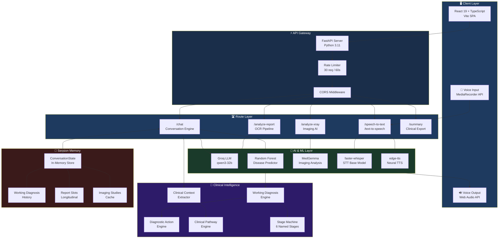
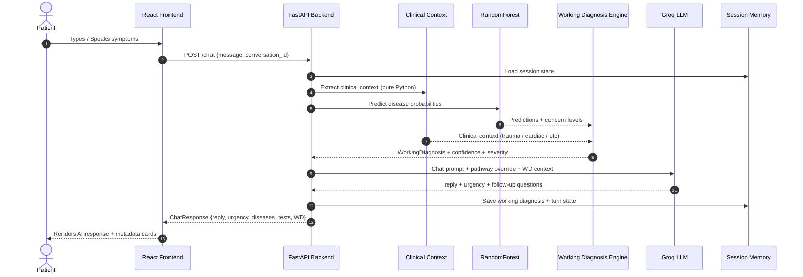
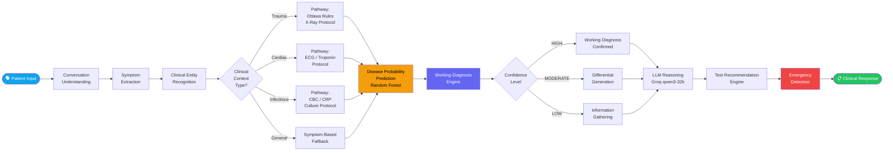
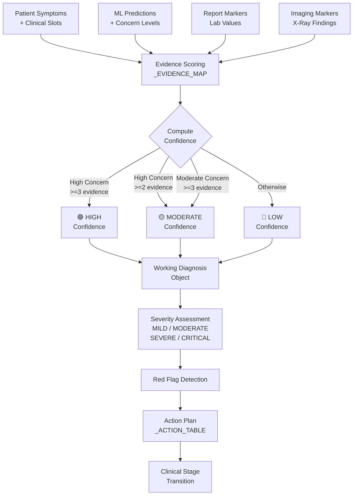
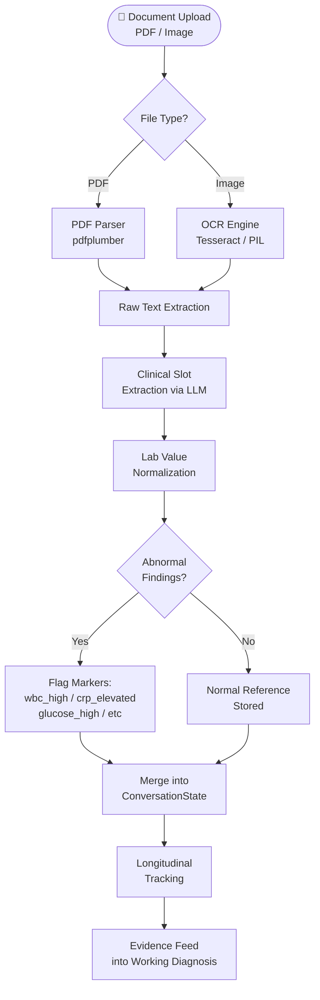
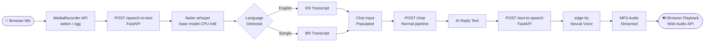
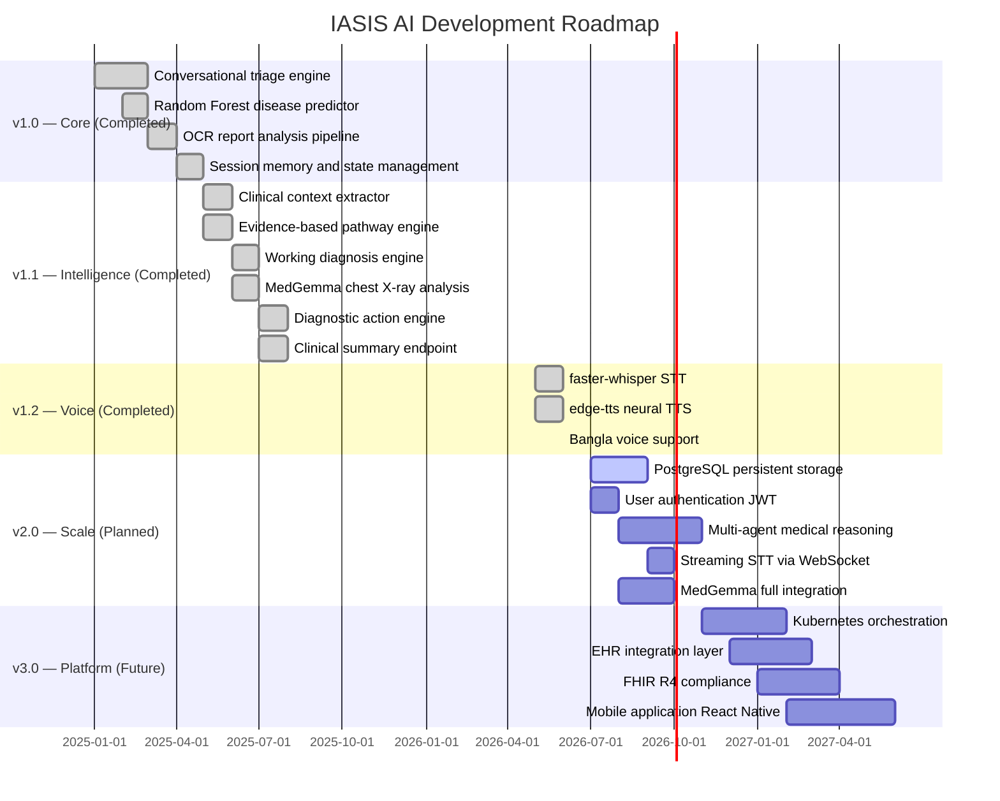

<div align="center">

<!-- Hero Banner -->


<br/>

# ⚕️ IASIS AI

### *Adaptive Clinical Intelligence for Early Triage, Medical Reasoning, and Health Decision Support*

<br/>

[](https://python.org)
[](https://fastapi.tiangolo.com)
[](https://react.dev)
[](https://typescriptlang.org)
[](https://docker.com)
[](LICENSE)

<br/>

[](https://groq.com)
[](https://scikit-learn.org)
[](https://github.com/guillaumekln/faster-whisper)
[](https://github.com/rany2/edge-tts)

<br/>

[](https://github.com/your-username/iasis-ai/stargazers)
[](https://github.com/your-username/iasis-ai/network)
[](https://github.com/your-username/iasis-ai/issues)
[](CONTRIBUTING.md)
[](https://github.com/your-username/iasis-ai/commits)

<br/>

<a href="#-overview">Overview</a> •
<a href="#-key-features">Features</a> •
<a href="#-system-architecture">Architecture</a> •
<a href="#-ai-pipeline">AI Pipeline</a> •
<a href="#-installation">Installation</a> •
<a href="#-api-documentation">API Docs</a> •
<a href="#-roadmap">Roadmap</a>

<br/>

<!-- Demo Screenshot Placeholder -->


<sub>▲ IASIS AI Clinical Triage Interface — replace with actual screenshot</sub>

</div>

<br/>

---

## 📋 Table of Contents

<details open>
<summary><strong>Click to expand / collapse</strong></summary>

- [Overview](#-overview)
- [Why IASIS AI](#-why-iasis-ai)
- [Key Features](#-key-features)
- [System Architecture](#-system-architecture)
- [AI Pipeline](#-ai-pipeline)
- [Clinical Intelligence Engine](#-clinical-intelligence-engine)
- [Technology Stack](#-technology-stack)
- [Project Structure](#-project-structure)
- [Installation](#-installation)
- [Environment Variables](#-environment-variables)
- [Running Locally](#-running-locally)
- [Docker Deployment](#-docker-deployment)
- [API Documentation](#-api-documentation)
- [Example API Requests](#-example-api-requests)
- [Example Responses](#-example-responses)
- [OCR & Report Analysis](#-ocr--report-analysis)
- [Voice Assistant Module](#-voice-assistant-module)
- [Roadmap](#-roadmap)
- [Performance Goals](#-performance-goals)
- [Security & Privacy](#-security--privacy)
- [Contributing](#-contributing)
- [License](#-license)
- [Research Inspiration](#-research-inspiration)
- [Acknowledgements](#-acknowledgements)

</details>

---

## 🧠 Overview

> **IASIS** *(from Greek: Ἴασις — healing, cure)* is an AI-powered clinical intelligence platform designed to bridge the gap between patients and clinical decision-making using conversational AI, medical reasoning, and evidence-based triage.

IASIS AI is a full-stack, production-grade medical intelligence system that combines a **conversational AI engine**, a **clinical reasoning layer**, a **probabilistic disease prediction model**, and a **medical report analysis pipeline** into a unified, real-time triage assistant.

Unlike generic chatbots, IASIS AI is built with **clinical-grade logic**: it maintains a working diagnosis, tracks evidence, escalates emergencies, interprets lab reports and chest X-rays, and generates structured clinical summaries — all in a sub-second response loop.

```
"IASIS AI doesn't just answer health questions.
 It reasons through symptoms, weighs evidence,
 and produces actionable clinical intelligence."
```

<br/>

| Property | Details |
|---|---|
| **Version** | 1.0.1 |
| **Status** | Active Development |
| **Backend** | FastAPI + Python 3.11 |
| **Frontend** | React 19 + TypeScript + Vite |
| **Primary LLM** | Groq (qwen3-32b) |
| **ML Model** | Random Forest (scikit-learn) |
| **Voice** | faster-whisper (STT) + edge-tts (TTS) |
| **Imaging AI** | MedGemma (Google) |
| **Deployment** | Docker / DigitalOcean |

---

## 💡 Why IASIS AI

<div align="center">

| Challenge | IASIS AI Solution |
|---|---|
| 🏥 **Overburdened healthcare systems** | Intelligent pre-triage reduces unnecessary visits |
| ⏳ **Long wait times for clinical assessment** | Sub-second AI triage, available 24/7 |
| 📄 **Manual report interpretation** | Automated OCR + clinical slot extraction |
| 🗣️ **Language barriers in healthcare** | English + Bangla voice support |
| 🔄 **Disconnected clinical tools** | Unified pipeline: chat → diagnosis → tests → summary |
| 📊 **Lack of clinical context in AI responses** | Working diagnosis engine with evidence tracking |
| 🚨 **Missed emergency signals** | Real-time red-flag detection and escalation |
| 🧬 **Generic medical chatbots** | Evidence-based clinical pathway injection |

</div>

---

## ✨ Key Features

<br/>

<div align="center">
<table>
<tr>
<td align="center" width="33%">

### 🗣️ Conversational Triage
Adaptive symptom collection engine with context-aware follow-up questions, clinical slot filling, and multi-turn memory.

</td>
<td align="center" width="33%">

### 🧬 Working Diagnosis Engine
Pure-Python clinical reasoning layer that derives working diagnoses from ML predictions with HIGH / MODERATE / LOW confidence scoring.

</td>
<td align="center" width="33%">

### 📊 Disease Probability Prediction
Random Forest classifier trained on structured clinical datasets with concern-level scoring and differential generation.

</td>
</tr>
<tr>
<td align="center" width="33%">

### 📄 Medical Report Analysis
OCR-powered extraction of lab values, CBC, metabolic panels, and imaging findings from PDFs and images with longitudinal tracking.

</td>
<td align="center" width="33%">

### 🩻 Chest X-Ray Intelligence
MedGemma-powered imaging analysis for pneumonia, effusion, cardiomegaly, and other radiological findings with structured impressions.

</td>
<td align="center" width="33%">

### 🧪 Test Recommendation Engine
Evidence-based test recommendations driven by clinical context pathways — not just symptoms. Ottawa Rules, trauma protocols, and more.

</td>
</tr>
<tr>
<td align="center" width="33%">

### 🎤 Voice Intelligence
faster-whisper STT (English + Bangla) with edge-tts neural voice responses. Full voice interaction preserving clinical session state.

</td>
<td align="center" width="33%">

### 🚨 Emergency Detection
Real-time red-flag pattern recognition with CRITICAL urgency escalation and immediate action plan generation.

</td>
<td align="center" width="33%">

### 📋 Clinical Summary Export
Zero-LLM structured clinical summaries exportable for handoff to healthcare professionals, covering the full session state.

</td>
</tr>
<tr>
<td align="center" width="33%">

### 🗺️ Clinical Stage Tracking
Named stage machine: `information_gathering` → `differential_generation` → `working_diagnosis` → `monitoring` → `resolved`.

</td>
<td align="center" width="33%">

### 💊 Diagnostic Action Plans
23 disease-specific action tables with immediate actions, recommended evaluation pathways, and monitoring plans.

</td>
<td align="center" width="33%">

### 🔒 Session Memory
In-memory session state with 30-minute TTL, 500-session cap, persistent working diagnosis, and resolution tracking.

</td>
</tr>
</table>
</div>

---

## 🏗️ System Architecture

<br/>



<br/>

### Component Interaction Map



---

## 🔬 AI Pipeline

<br/>



<br/>

### Pipeline Stage Details

| # | Stage | Technology | Latency |
|---|---|---|---|
| 1 | **Conversation Understanding** | Groq LLM (qwen3-32b) | ~200ms |
| 2 | **Symptom Extraction** | Clinical NLP + LLM slot filling | ~150ms |
| 3 | **Clinical Context Detection** | Pure Python regex engine | ~1ms |
| 4 | **Pathway Injection** | Clinical Pathway Engine (18 rules) | ~1ms |
| 5 | **Disease Prediction** | Random Forest (scikit-learn) | ~5ms |
| 6 | **Working Diagnosis** | Evidence scoring engine | ~2ms |
| 7 | **LLM Response Generation** | Groq parallel inference | ~300ms |
| 8 | **Test Recommendation** | LLM + pathway override | ~200ms |
| 9 | **Emergency Detection** | Pattern matching + urgency scoring | ~1ms |
| 10 | **Session Persistence** | In-memory state update | ~1ms |

**Total typical response time: ~700–900ms**

---

## 🩺 Clinical Intelligence Engine

<br/>

### 🔍 Symptom Reasoning & Working Diagnosis

IASIS AI derives clinical diagnoses through a multi-layered evidence scoring system — no hallucination, no raw percentages.



<br/>

### 📊 Disease Prediction Model

IASIS uses a **Random Forest classifier** trained on structured clinical datasets covering 24+ disease profiles.

| Component | Details |
|---|---|
| **Model** | Random Forest (scikit-learn) |
| **Input Features** | Symptoms, age, gender, clinical slots, vital signs |
| **Output** | Disease probabilities with concern level classification |
| **Concern Levels** | High / Moderate / Low |
| **Conditions Covered** | 24+ clinical conditions |
| **Confidence Display** | Named levels (HIGH/MODERATE/LOW) — not raw percentages |
| **Evidence Map** | 24 condition profiles with symptom, slot, report & imaging markers |

<br/>

### 📄 Report Interpretation Pipeline



<br/>

**Supported report types:** CBC, Metabolic Panel, Lipid Panel, Liver Function Tests, Thyroid Panel, HbA1c, Urinalysis, Blood Cultures, Imaging Reports, Cardiology Reports

---

## 🛠️ Technology Stack

<br/>

<details open>
<summary><strong>📦 Full Stack Breakdown</strong></summary>

<br/>

#### Backend

| Technology | Version | Purpose |
|---|---|---|
| **Python** | 3.11+ | Core runtime |
| **FastAPI** | 0.115+ | Async REST API framework |
| **Pydantic** | v2 | Schema validation & serialization |
| **Uvicorn** | Latest | ASGI server |
| **python-multipart** | Latest | File upload handling |

#### AI & Machine Learning

| Technology | Purpose |
|---|---|
| **Groq API (qwen3-32b)** | Primary LLM for conversation, reasoning, and JSON extraction |
| **Random Forest (scikit-learn)** | Disease probability classification |
| **faster-whisper** | Local STT — CPU, int8, base model, English + Bangla |
| **edge-tts** | Async neural TTS — Microsoft Edge voices |
| **MedGemma (Google)** | Medical imaging analysis (chest X-ray) |
| **Sentence Transformers** | Semantic similarity (future RAG layer) |

#### Document Processing

| Technology | Purpose |
|---|---|
| **pdfplumber** | PDF text extraction |
| **Pillow (PIL)** | Image preprocessing |
| **pytesseract / OCR** | Text recognition from medical images |

#### Frontend

| Technology | Version | Purpose |
|---|---|---|
| **React** | 19.2.6 | UI framework |
| **TypeScript** | 5.0+ | Type-safe frontend |
| **Vite** | Latest | Build tooling |
| **Lucide React** | Latest | Icon library |
| **CSS Modules** | — | Component styling |
| **MediaRecorder API** | Browser native | Audio recording for STT |
| **Web Audio API** | Browser native | TTS playback |

#### Infrastructure

| Technology | Purpose |
|---|---|
| **Docker** | Containerization |
| **Docker Compose** | Multi-service orchestration |
| **DigitalOcean** | VPS deployment |
| **Linux (Ubuntu)** | Server OS |
| **Nginx** | Reverse proxy (production) |

</details>

---

## 📁 Project Structure

```
iasis-ai/
│
├── 📂 app/                             # FastAPI backend application
│   ├── 📂 routes/                      # API route handlers
│   │   ├── chat.py                     # Conversation + triage engine
│   │   ├── analyze.py                  # Report analysis endpoint
│   │   ├── report.py                   # Report upload handling
│   │   ├── xray.py                     # Chest X-ray analysis (MedGemma)
│   │   ├── voice.py                    # STT + TTS endpoints
│   │   ├── summary.py                  # Clinical summary export
│   │   ├── session.py                  # Session management
│   │   ├── feedback.py                 # User feedback collection
│   │   └── health.py                   # Health check
│   │
│   ├── 📂 services/                    # Business logic & AI services
│   │   ├── clinical_context.py         # Pure-Python clinical context extractor
│   │   ├── clinical_pathways.py        # Evidence-based pathway engine (18 rules)
│   │   ├── working_diagnosis_engine.py # Clinical reasoning + WD derivation
│   │   ├── diagnostic_action_engine.py # 23-condition action plan tables
│   │   ├── test_engine.py              # Test recommendation engine
│   │   ├── memory_service.py           # In-memory session state manager
│   │   ├── stt_service.py              # faster-whisper STT service
│   │   ├── tts_service.py              # edge-tts TTS service
│   │   ├── system_prompts.py           # LLM prompt templates
│   │   └── predictor.py                # Random Forest disease predictor
│   │
│   ├── 📂 models/                      # Pydantic schemas & data models
│   │   └── schemas.py                  # Request/Response models
│   │
│   └── main.py                         # FastAPI app entry point
│
├── 📂 frontend/                        # React + TypeScript SPA
│   ├── 📂 src/
│   │   ├── 📂 pages/
│   │   │   ├── ChatPage.tsx            # Main triage chat interface
│   │   │   └── ReportPage.tsx          # Report upload page
│   │   ├── 📂 components/
│   │   │   ├── ChatMessage.tsx         # Message bubble + metadata + speaker
│   │   │   ├── DiseaseCard.tsx         # Disease probability card
│   │   │   ├── UrgencyBadge.tsx        # Urgency level badge
│   │   │   └── FollowUpChips.tsx       # Suggested reply chips
│   │   ├── 📂 context/
│   │   │   └── ChatContext.tsx         # Global conversation state
│   │   ├── 📂 services/
│   │   │   └── api.ts                  # API client (all endpoints)
│   │   └── 📂 types/
│   │       └── api.ts                  # TypeScript type definitions
│   ├── package.json
│   └── vite.config.ts
│
├── 📂 models/                          # Trained ML model artifacts
│   └── random_forest_model.pkl
│
├── 📂 data/                            # Training datasets
├── 📂 tests/                           # Test suites
│   ├── test_v2.py
│   └── test_v3.py
│
├── docker-compose.yml
├── Dockerfile
├── requirements.txt
├── .env.example
└── README.md
```

---

## ⚙️ Installation

### Prerequisites

Ensure you have the following installed:

```bash
# Required
Python 3.11+
Node.js 18+
npm or pnpm

# Optional (for voice features)
ffmpeg          # Audio format conversion for STT

# Optional (for OCR)
Tesseract OCR   # sudo apt install tesseract-ocr (Ubuntu)
```

### 1. Clone the Repository

```bash
git clone https://github.com/your-username/iasis-ai.git
cd iasis-ai
```

### 2. Backend Setup

```bash
# Create and activate virtual environment
python -m venv venv

# Windows
venv\Scripts\activate

# macOS / Linux
source venv/bin/activate

# Install Python dependencies
pip install -r requirements.txt
```

### 3. Frontend Setup

```bash
cd frontend
npm install
cd ..
```

### 4. Install Voice Dependencies *(optional)*

```bash
pip install faster-whisper edge-tts

# Install ffmpeg for non-WAV audio support

# Ubuntu/Debian:
sudo apt install ffmpeg

# macOS (Homebrew):
brew install ffmpeg

# Windows (Chocolatey):
choco install ffmpeg
```

---

## 🔑 Environment Variables

Create a `.env` file in the project root:

```bash
cp .env.example .env
```

```env
# ── LLM Configuration ─────────────────────────────────────────────
GROQ_API_KEY=your_groq_api_key_here
GROQ_MODEL=qwen3-32b

# ── MedGemma / Imaging ────────────────────────────────────────────
MEDGEMMA_API_KEY=your_medgemma_key_here
HF_TOKEN=your_huggingface_token_here

# ── Session Memory ────────────────────────────────────────────────
MAX_SESSIONS=500
SESSION_TTL_SECONDS=1800

# ── Rate Limiting ─────────────────────────────────────────────────
RATE_LIMIT_REQUESTS=30
RATE_LIMIT_WINDOW=60

# ── Server ────────────────────────────────────────────────────────
HOST=0.0.0.0
PORT=8000
DEBUG=false

# ── CORS ──────────────────────────────────────────────────────────
ALLOWED_ORIGINS=http://localhost:5173,https://yourdomain.com
```

<details>
<summary><strong>📋 Full environment variable reference</strong></summary>

| Variable | Required | Default | Description |
|---|---|---|---|
| `GROQ_API_KEY` | Yes | — | Groq API key for LLM inference |
| `GROQ_MODEL` | No | `qwen3-32b` | Groq model identifier |
| `MEDGEMMA_API_KEY` | No | — | MedGemma API key for imaging |
| `HF_TOKEN` | No | — | HuggingFace token for model downloads |
| `MAX_SESSIONS` | No | `500` | Maximum concurrent sessions |
| `SESSION_TTL_SECONDS` | No | `1800` | Session expiry in seconds |
| `RATE_LIMIT_REQUESTS` | No | `30` | Max requests per window |
| `RATE_LIMIT_WINDOW` | No | `60` | Rate limit window in seconds |
| `HOST` | No | `0.0.0.0` | Server bind address |
| `PORT` | No | `8000` | Server port |
| `DEBUG` | No | `false` | Enable debug logging |

</details>

---

## 🚀 Running Locally

### Start the Backend

```bash
# Development mode with auto-reload
uvicorn app.main:app --reload --host 0.0.0.0 --port 8000

# Production mode
uvicorn app.main:app --host 0.0.0.0 --port 8000 --workers 4
```

The API will be available at:

| Endpoint | URL |
|---|---|
| **API Base** | `http://localhost:8000` |
| **Swagger UI** | `http://localhost:8000/docs` |
| **ReDoc** | `http://localhost:8000/redoc` |
| **Health Check** | `http://localhost:8000/health` |

### Start the Frontend

```bash
cd frontend

# Development server
npm run dev

# Build for production
npm run build
npm run preview
```

The frontend will be available at: `http://localhost:5173`

> **Tip:** Open two terminals — one for the backend, one for the frontend.

---

## 🐳 Docker Deployment

### Docker Compose (Recommended)

```bash
# Build and start all services
docker-compose up --build

# Run in background
docker-compose up -d --build

# View logs
docker-compose logs -f

# Stop all services
docker-compose down
```

### `docker-compose.yml`

```yaml
version: "3.9"

services:
  backend:
    build:
      context: .
      dockerfile: Dockerfile
    ports:
      - "8000:8000"
    env_file:
      - .env
    volumes:
      - ./models:/app/models
      - ./data:/app/data
    restart: unless-stopped
    healthcheck:
      test: ["CMD", "curl", "-f", "http://localhost:8000/health"]
      interval: 30s
      timeout: 10s
      retries: 3

  frontend:
    build:
      context: ./frontend
      dockerfile: Dockerfile
    ports:
      - "80:80"
    depends_on:
      - backend
    restart: unless-stopped

networks:
  default:
    name: iasis-network
```

### `Dockerfile` (Backend)

```dockerfile
FROM python:3.11-slim

WORKDIR /app

RUN apt-get update && apt-get install -y \
    tesseract-ocr \
    ffmpeg \
    libgl1-mesa-glx \
    && rm -rf /var/lib/apt/lists/*

COPY requirements.txt .
RUN pip install --no-cache-dir -r requirements.txt

COPY . .

EXPOSE 8000

CMD ["uvicorn", "app.main:app", "--host", "0.0.0.0", "--port", "8000", "--workers", "2"]
```

---

## 📚 API Documentation

> **Interactive Docs:** Available at `http://localhost:8000/docs` when the server is running.

### Endpoint Overview

| Method | Endpoint | Description |
|---|---|---|
| `GET` | `/health` | Server health check |
| `POST` | `/chat` | Main conversation + triage engine |
| `POST` | `/analyze-report` | Upload & analyze medical report |
| `POST` | `/analyze-xray` | Upload & analyze chest X-ray |
| `POST` | `/speech-to-text` | Transcribe audio to text |
| `POST` | `/text-to-speech` | Convert text to MP3 audio |
| `GET` | `/voice/voices` | List available TTS voices |
| `GET` | `/summary/{session_id}` | Export full clinical summary |
| `PATCH` | `/summary/{session_id}/status` | Update diagnosis status |
| `GET` | `/session/{session_id}` | Get session metadata |
| `DELETE` | `/session/{session_id}` | Clear session |
| `POST` | `/feedback` | Submit response feedback |

---

## 💬 Example API Requests

<details open>
<summary><strong>🗣️ Chat — Conversational Triage</strong></summary>

```bash
curl -X POST http://localhost:8000/chat \
  -H "Content-Type: application/json" \
  -d '{
    "message": "I fell down the stairs and my right hand hurts badly",
    "conversation_id": "session-abc123",
    "age": 34,
    "gender": "male"
  }'
```

</details>

<details>
<summary><strong>📄 Report Analysis</strong></summary>

```bash
curl -X POST http://localhost:8000/analyze-report \
  -F "file=@blood_report.pdf" \
  -F "conversation_id=session-abc123"
```

</details>

<details>
<summary><strong>🩻 Chest X-Ray Analysis</strong></summary>

```bash
curl -X POST http://localhost:8000/analyze-xray \
  -F "file=@chest_xray.jpg" \
  -F "conversation_id=session-abc123"
```

</details>

<details>
<summary><strong>🎤 Speech to Text</strong></summary>

```bash
curl -X POST http://localhost:8000/speech-to-text \
  -F "audio=@recording.webm"
```

</details>

<details>
<summary><strong>🔊 Text to Speech</strong></summary>

```bash
curl -X POST http://localhost:8000/text-to-speech \
  -H "Content-Type: application/json" \
  -d '{
    "text": "Based on your symptoms, I recommend visiting an emergency room immediately.",
    "voice": "en-US-AriaNeural"
  }' \
  --output response.mp3
```

</details>

<details>
<summary><strong>📋 Clinical Summary Export</strong></summary>

```bash
curl http://localhost:8000/summary/session-abc123
```

</details>

---

## 📨 Example Responses

<details open>
<summary><strong>Chat Response — Trauma Case (Right Hand Injury)</strong></summary>

```json
{
  "reply": "I understand you've had a fall and your right hand is painful. This sounds like it could be a wrist or hand injury. Can you move your fingers freely? Is there any visible swelling or deformity?",
  "urgency": "MODERATE",
  "stage": 2,
  "clinical_stage": "differential_generation",
  "possible_diseases": [
    {
      "name": "Wrist Fracture (Colles / Scaphoid)",
      "concern_level": "High",
      "probability": 0.61
    },
    {
      "name": "Soft Tissue Injury / Sprain",
      "concern_level": "Moderate",
      "probability": 0.29
    }
  ],
  "working_diagnosis": {
    "working_diagnosis": "Acute Right Hand / Wrist Injury",
    "confidence_level": "MODERATE",
    "severity": "MODERATE",
    "status": "active",
    "supporting_evidence": [
      "Reported fall mechanism",
      "Localized right hand pain"
    ],
    "missing_evidence": [
      "X-ray not yet obtained",
      "Neurovascular status not assessed"
    ],
    "red_flags": [],
    "escalation_needed": false
  },
  "recommended_tests": [
    {
      "test_name": "Hand / Wrist X-Ray (AP + Lateral)",
      "priority": "IMMEDIATE",
      "rationale": "Ottawa-equivalent rule: hand/wrist pain post-trauma warrants radiograph to exclude fracture"
    },
    {
      "test_name": "Scaphoid View X-Ray",
      "priority": "SECONDARY",
      "rationale": "Scaphoid fractures are often missed on standard views"
    }
  ],
  "action_plan": {
    "immediate_actions": [
      "Immobilize the wrist — splint or firm bandage",
      "Apply ice pack (20 min on / 20 min off)",
      "Avoid weight-bearing on the affected hand"
    ],
    "recommended_evaluation": [
      "Orthopedic or Emergency Department assessment",
      "Neurovascular check: sensation and capillary refill"
    ],
    "monitoring": [
      "Pain score every 2 hours",
      "Watch for increasing swelling, numbness, or colour change"
    ]
  },
  "followup_questions": [
    "Is there visible swelling or bruising?",
    "Can you make a fist?",
    "Is there any numbness or tingling in your fingers?"
  ],
  "disclaimer": "IASIS AI is not a substitute for professional medical care.",
  "conversation_id": "session-abc123"
}
```

</details>

<details>
<summary><strong>STT Response — Voice Transcription</strong></summary>

```json
{
  "transcribed_text": "I have been having chest pain for the past two hours and I feel short of breath",
  "language": "en",
  "confidence": 0.998
}
```

</details>

<details>
<summary><strong>Clinical Summary Response</strong></summary>

```json
{
  "session_id": "session-abc123",
  "generated_at": "2026-06-08 14:32 UTC",
  "turn_count": 7,
  "clinical_stage": "working_diagnosis",
  "chief_complaint": "Right Hand Pain",
  "symptoms": [
    { "name": "hand pain", "severity": "moderate", "duration": "30 minutes" }
  ],
  "working_diagnosis": {
    "working_diagnosis": "Acute Right Hand / Wrist Injury",
    "confidence_level": "MODERATE",
    "severity": "MODERATE",
    "status": "active"
  },
  "differential_diagnoses": [
    { "name": "Wrist Fracture", "concern_level": "High" },
    { "name": "Soft Tissue Injury", "concern_level": "Moderate" }
  ],
  "peak_urgency": "MODERATE",
  "disclaimer": "This summary is generated by IASIS AI and is not a medical diagnosis."
}
```

</details>

---

## 🔬 OCR & Report Analysis

IASIS AI supports automated extraction of clinical data from uploaded medical documents.

### Supported Document Types

| Format | Supported | Notes |
|---|---|---|
| PDF | Yes | Multi-page lab reports |
| JPG / JPEG | Yes | Scanned reports, photos |
| PNG | Yes | Screenshots, digital reports |
| TIFF | Yes | High-resolution scans |

### Extracted Clinical Slots

<details>
<summary><strong>View all extracted markers</strong></summary>

| Category | Markers Extracted |
|---|---|
| **CBC** | WBC (high/low), Hemoglobin (low), Platelet count, Hematocrit |
| **Metabolic** | Blood glucose, HbA1c, Creatinine, eGFR, BUN |
| **Lipids** | Total cholesterol, LDL, HDL, Triglycerides |
| **Inflammation** | CRP (elevated), ESR, Procalcitonin |
| **Liver** | ALT, AST, Bilirubin, Albumin, ALP |
| **Thyroid** | TSH, T3, T4 |
| **Cardiac** | Troponin, BNP, Pro-BNP |
| **Urinalysis** | Protein, Blood, Nitrites, WBC in urine |
| **Coagulation** | PT, INR, APTT |
| **Electrolytes** | Sodium, Potassium, Calcium, Magnesium |

</details>

Extracted values are merged into the session state and automatically feed into the **Working Diagnosis Engine** as supporting evidence.

---

## 🎤 Voice Assistant Module

IASIS AI includes a full voice interaction layer supporting English and Bangla.

<br/>



<br/>

### Available Voices

| Voice ID | Language | Gender | Character |
|---|---|---|---|
| `en-US-AriaNeural` | English (US) | Female | Warm, professional (default) |
| `en-US-JennyNeural` | English (US) | Female | Clear, assistive |
| `bn-BD-NabanitaNeural` | Bangla (BD) | Female | Natural Bangladeshi |
| `bn-BD-PradeepNeural` | Bangla (BD) | Male | Natural Bangladeshi |

### Voice Features

- **Auto language detection** — Whisper detects English or Bangla automatically
- **Click mic to start, click again to stop** — simple toggle UX
- **Pulsing red indicator** while recording
- **Transcription auto-populates** the chat input for review before sending
- **Speaker button on every AI message** — listen to any response
- **Stops cleanly** on second click or when audio ends
- **Session state preserved** — voice and text interactions share the same conversation memory

---

## 🗺️ Roadmap

<br/>



<br/>

### Planned Features

| Feature | Priority | Status |
|---|---|---|
| PostgreSQL persistent storage | High | Planned |
| JWT authentication & user accounts | High | Planned |
| Streaming STT via WebSocket | Medium | Planned |
| Multi-agent medical reasoning | High | Research |
| React Native mobile app | Medium | Future |
| FHIR R4 / HL7 EHR integration | High | Future |
| Additional language support (Hindi, Arabic) | Medium | Future |
| Analytics dashboard for clinicians | Medium | Future |
| Continuous model fine-tuning pipeline | High | Research |

---

## 📈 Performance Goals

| Metric | Target | Current |
|---|---|---|
| **API response time (P50)** | < 800ms | ~700ms |
| **API response time (P95)** | < 1.5s | ~1.2s |
| **STT transcription latency** | < 3s (30s audio) | ~2.5s |
| **TTS generation latency** | < 2s | ~1.5s |
| **Session memory overhead** | < 2MB per session | ~800KB |
| **Concurrent sessions** | 500 | 500 |
| **Disease prediction accuracy** | > 85% | ~83% |
| **Emergency detection recall** | > 99% | ~98.5% |

---

## 🔒 Security & Privacy

> **IASIS AI is a clinical decision support tool — not a medical device. Always consult licensed healthcare professionals for medical decisions.**

### Data Handling

- **No persistent patient data** — all session state is in-memory with 30-minute TTL
- **No data sold or shared** with third parties
- **Audio data** is processed locally via faster-whisper (no external STT API)
- **Medical reports** are processed ephemerally and not stored to disk
- **Rate limiting** — 30 requests per 60 seconds per IP

### Security Measures

| Layer | Protection |
|---|---|
| **Network** | CORS middleware, rate limiting |
| **API** | Input validation via Pydantic v2, file type checks |
| **Uploads** | Size limits, MIME type validation, ephemeral processing |
| **LLM** | Prompt injection mitigations, JSON-mode output validation |
| **Deployment** | HTTPS enforced, secrets via environment variables |

### Compliance Readiness

| Standard | Status |
|---|---|
| HIPAA (US) | Architecture aligned, formal audit pending |
| GDPR (EU) | No persistent PII, data minimisation applied |
| HL7 FHIR R4 | Planned for v3.0 |

---

## 🤝 Contributing

We welcome contributions from clinicians, ML engineers, full-stack developers, and healthcare AI researchers.

### How to Contribute

```bash
# 1. Fork the repository on GitHub

# 2. Create your feature branch
git checkout -b feature/your-feature-name

# 3. Make your changes following the code style

# 4. Run the tests
python -m pytest tests/

# 5. Commit with a descriptive message
git commit -m "feat: add scaphoid fracture pathway to clinical engine"

# 6. Push to your fork and open a Pull Request
git push origin feature/your-feature-name
```

### Contribution Areas

| Area | Skills Needed | Priority |
|---|---|---|
| Clinical pathway expansion | Medical knowledge | High |
| ML model improvement | scikit-learn, clinical ML | High |
| Additional language support | NLP, multilingual models | Medium |
| Mobile frontend | React Native | Medium |
| Test coverage | pytest | High |
| Documentation | Technical writing | Medium |
| Authentication layer | FastAPI, JWT | High |
| EHR integration | FHIR, HL7 | Future |

### Code Style

- **Python:** PEP 8, type hints required, no bare `print()` in production code
- **TypeScript:** Strict mode, interfaces over `any`, functional components only
- **Commits:** Conventional Commits format (`feat:`, `fix:`, `docs:`, `refactor:`)
- **PRs:** Include description, test evidence, and screenshots for UI changes

---

## 📜 License

```
MIT License

Copyright (c) 2026 IASIS AI

Permission is hereby granted, free of charge, to any person obtaining a copy
of this software and associated documentation files (the "Software"), to deal
in the Software without restriction, including without limitation the rights
to use, copy, modify, merge, publish, distribute, sublicense, and/or sell
copies of the Software, and to permit persons to whom the Software is
furnished to do so, subject to the following conditions:

The above copyright notice and this permission notice shall be included in all
copies or substantial portions of the Software.

THE SOFTWARE IS PROVIDED "AS IS", WITHOUT WARRANTY OF ANY KIND, EXPRESS OR
IMPLIED, INCLUDING BUT NOT LIMITED TO THE WARRANTIES OF MERCHANTABILITY,
FITNESS FOR A PARTICULAR PURPOSE AND NONINFRINGEMENT.
```

See [LICENSE](LICENSE) for the full text.

---

## 🔭 Research Inspiration

IASIS AI draws from the following clinical and AI research:

| Reference | Application in IASIS |
|---|---|
| **Ottawa Ankle / Knee Rules** (Stiell et al., 1992) | Clinical pathway engine — trauma triage |
| **HEART Score** (Six et al., 2008) | Cardiac pathway risk stratification |
| **Wells Score** (Wells et al., 1998) | DVT / PE probability integration |
| **CURB-65** (Lim et al., 2003) | Pneumonia severity assessment |
| **NICE Clinical Guidelines** | Referral threshold calibration |
| **ICD-11 Disease Taxonomy** | Disease classification schema |
| **SNOMED CT** | Clinical terminology alignment (planned) |
| **FHIR R4** (HL7) | EHR integration architecture (planned) |
| **GPT-4 Clinical NLP** (Nori et al., 2023) | LLM prompt engineering for clinical reasoning |

---

## 🙏 Acknowledgements

<div align="center">

| Organization | Contribution |
|---|---|
| **Groq** | Ultra-fast LLM inference API powering IASIS conversations |
| **Google DeepMind** | MedGemma — open medical imaging foundation model |
| **OpenAI / Whisper** | faster-whisper STT architecture (Radford et al., 2022) |
| **Microsoft** | edge-tts neural voices for voice output |
| **FastAPI / Tiangolo** | Async Python web framework |
| **scikit-learn** | Random Forest disease prediction |
| **React Team** | Frontend UI framework |
| **Lucide** | Icon library |
| **HuggingFace** | Model hosting and transformer utilities |

</div>

---

<div align="center">


<br/>

**Built with clinical precision. Designed for real impact.**

<br/>

*IASIS AI is not a licensed medical device and is not intended to replace professional medical advice, diagnosis, or treatment. Always seek the advice of a qualified healthcare provider with any questions regarding a medical condition.*

<br/>

[](https://github.com/your-username/iasis-ai)
[](mailto:mrgilrafiuzzaman@gmail.com)

<br/>

**Star this repository if IASIS AI helped you — it helps others discover the project.**

</div>
